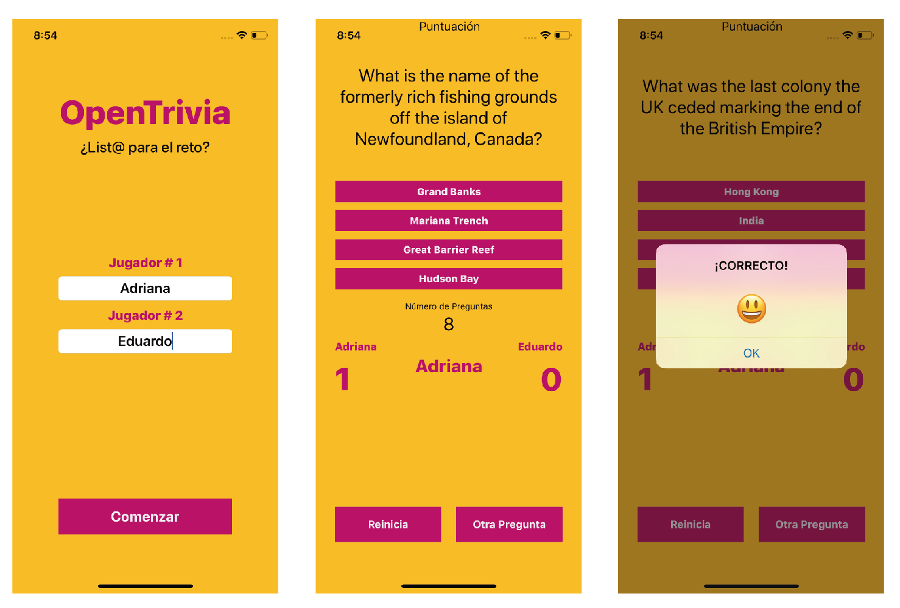

# OpenTrivia
Practica de juego para 2 participantes el cual se basa en la selección simple de respuesta a una pregunta realizada sobre diversos temas : Juegos, Geografía, Peliculas, etc.
Para su realización se uso la base de datos de Open trivia, la cual ofrece un API con los datos necesarios para ello

## Realizada en Xcode 10.3 e iOS 12  Swift 4
## API: https://opentdb.com

