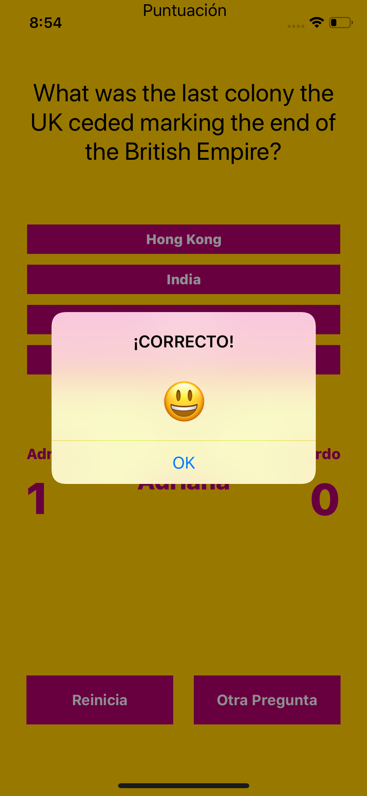
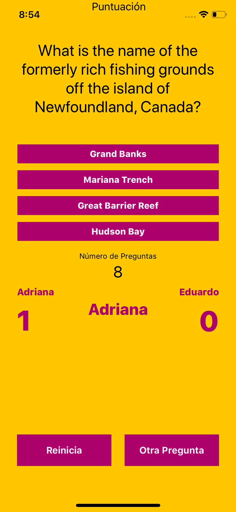

# OpenTrivia
##Practica de juego para 2 participantes el cual se basa en la seleccion simple de respuesta a una pregunta realizada sobre diversos temas : Juegos, Geografia, Peliculas, etc.
Para su realizacion se uso la base de datos de Open trivia, la cual ofrece un API con los datos

## Realizada en Xcode 10.3 e iOS 12
## API: https://opentdb.com

